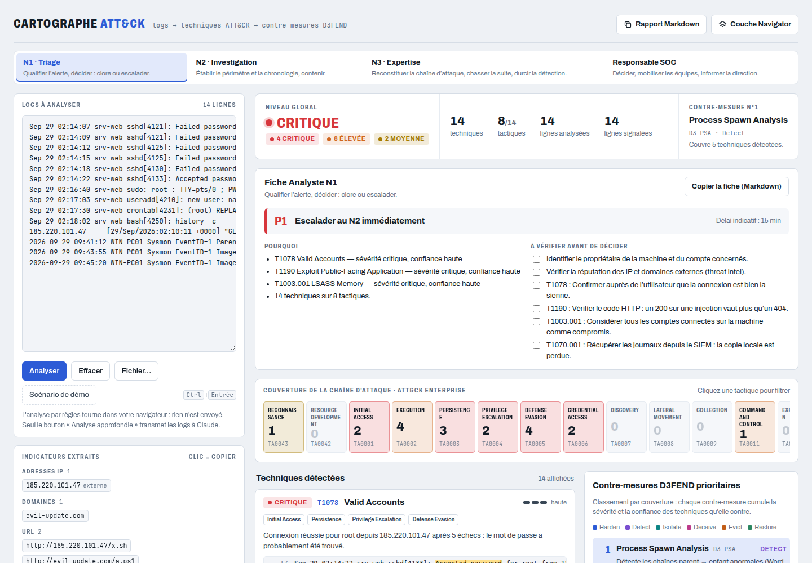
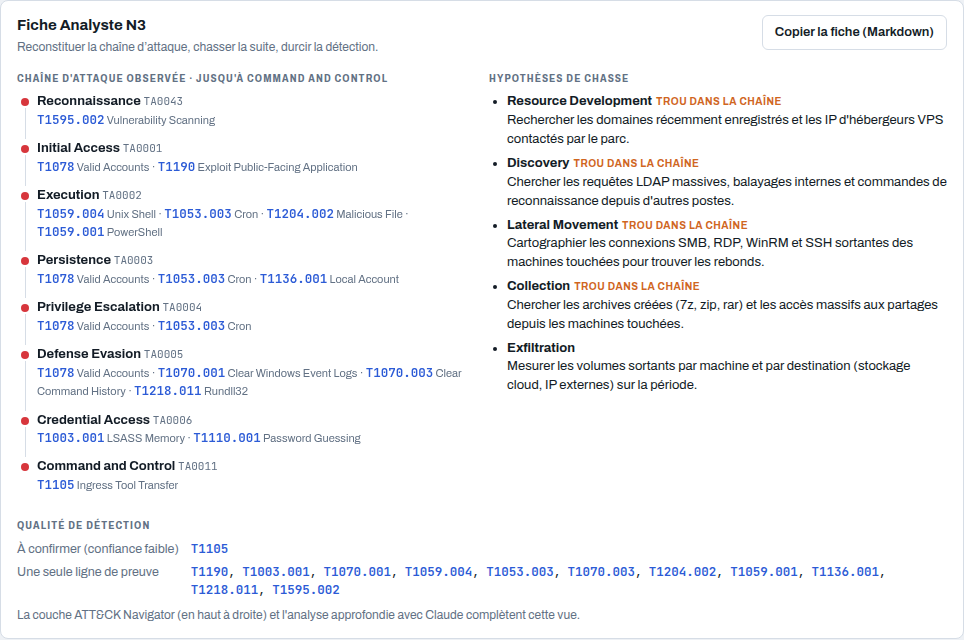
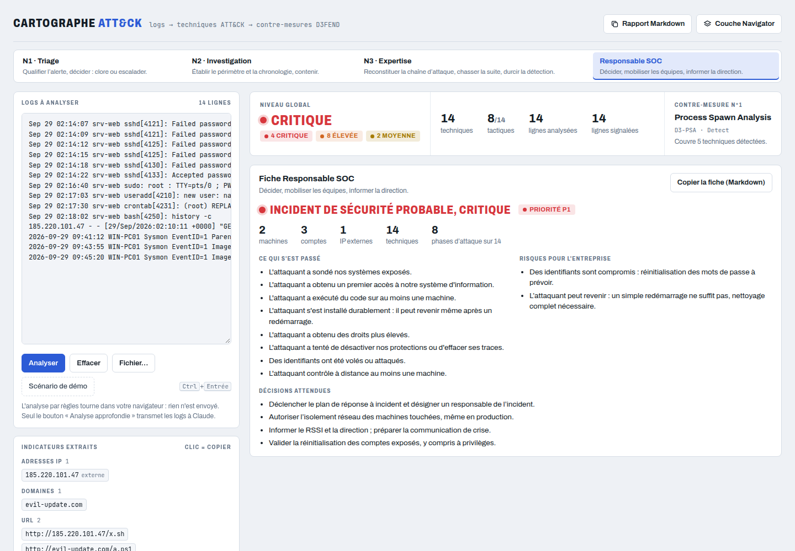

# Cartographe ATT&CK

Outil de triage SOC : on colle des logs, il sort les techniques MITRE ATT&CK détectées, les lignes qui le prouvent et les contre-mesures D3FEND à prioriser. La page est publiée comme Artifact claude.ai.



Quatre lectures des mêmes logs, du N1 au responsable du SOC :

| Niveau | Fiche |
| --- | --- |
| N1 · Triage | Priorité P1–P4, décision (escalader ou clore), délai indicatif, checklist |
| N2 · Investigation | Périmètre (machines, comptes, IP, domaines, fichiers), chronologie, confinement |
| N3 · Expertise | Chaîne d'attaque observée, hypothèses de chasse, qualité de détection |
| Responsable SOC | Gravité, récit en langage courant, risques pour l'entreprise, décisions attendues |

Chaque fiche se copie en Markdown pour le ticket. Le bouton « Scénario de démo » charge une attaque fictive pour découvrir l'outil.

<p> </p>

## Formats acceptés

- Texte, un événement par ligne : syslog / auth.log, access.log, Sysmon ou Security en `clé=valeur`, sorties EDR ou pare-feu.
- JSON : tableau, objet (`Records`, `events`, `hits.hits`) ou JSONL. Chaque événement est aplati en `clé=valeur` ; les champs ECS courants (`event.code`, `host.name`, `user.name`…) sont renommés vers leur équivalent Windows.
- Export XML des journaux Windows (`<Event>…</Event>`, par exemple `wevtutil qe Security /f:xml`) : un événement par ligne avec horodatage, `EventID`, `Computer` et les champs `Data`.

Les `.evtx` binaires doivent d'abord être exportés en XML ou en texte.

## Règles Sigma

En plus de ses propres règles, l'outil exécute des règles [Sigma](https://sigmahq.io) :

- 6 règles intégrées (`rules/sigma.yml`), écrites pour ce projet : Office qui lance un interpréteur, accès mémoire à LSASS, service installé depuis un dossier inscriptible, tâche planifiée suspecte, Kerberoasting en RC4, ajout à un groupe privilégié.
- Import depuis la page : fichiers `.yml` ou dossier entier, par exemple `rules/windows` du [dépôt SigmaHQ](https://github.com/SigmaHQ/sigma). Les règles importées sont mémorisées dans le navigateur.

Une détection Sigma s'ajoute à la technique ATT&CK de ses tags et porte le badge « Sigma » ; quand une règle locale voit la même technique, les preuves sont fusionnées. Sur les 1 586 règles SigmaHQ de `rules/windows/process_creation`, `rules/windows/builtin/security`, `rules/linux` et `rules/web`, 1 439 s'exécutent (environ 0,8 s pour 1 000 lignes) ; les autres sont listées avec leur raison :

- pas de technique ATT&CK dans les tags (140) ;
- modificateurs non pris en charge : `base64`, `base64offset`, `fieldref` (7) ;
- agrégations (`| count() by …`) et règles de corrélation.

Pris en charge : sélections par champs ou mots-clés, `contains`, `startswith`, `endswith`, `all`, `re` (et `(?i)` en tête), `windash`, `cidr` (IPv4), `exists`, valeurs `null`, jokers `*` `?`, conditions `and` / `or` / `not` / parenthèses / `1 of` / `all of` / `them`. Les tags `stealth` et `defense-impairment` sont rattachés à Defense Evasion.

Les champs lus par Sigma viennent du XML Windows, du JSON (champs ECS renommés : `process.command_line` → `CommandLine`…), des paires `clé=valeur` d'une ligne texte, et des champs W3C d'une ligne access.log (`c-uri`, `cs-uri-query`, `c-useragent`, `sc-status`…).

## Limites

- Les règles locales sont des expressions régulières maison (une par technique) ; Sigma les complète sur les logs à champs. C'est un assistant de triage, pas un outil de détection de production.
- Les délais du N1 et les décisions proposées au responsable sont indicatifs et à aligner sur les SLA et procédures du SOC.

## Commandes

```sh
npm install        # une fois : installe esbuild et js-yaml
npm test           # intégrité des règles + moteur sur les 4 exemples
npm run build      # produit dist/cartographe-attack.html (à publier) et dist/preview.html (à ouvrir en local)
npm run dev        # reconstruit à chaque modification de src/ ou rules/
```

En local, ouvrir `dist/preview.html` dans un navigateur. Le panneau « Analyse approfondie avec Claude » n'apparaît que dans claude.ai, où la capacité `sample` existe.

## Organisation

| Chemin | Contenu |
| --- | --- |
| `rules/attack-rules.json` | Règles de détection, une par technique ATT&CK |
| `rules/d3fend.json` | Catalogue des contre-mesures D3FEND |
| `rules/tactics.json` | Les 14 tactiques ATT&CK Enterprise, dans l'ordre de la chaîne, avec leur phrase pour la direction (`plain`) et leur piste de chasse N3 (`hunt`) |
| `samples/*.log` | Scénarios fictifs pour les tests ; `demo.log` est aussi chargé par le bouton « Scénario de démo » |
| `src/engine.js` | Analyse, corrélation d'authentification, priorisation D3FEND, extraction d'IOC (sans DOM) |
| `src/levels.js` | Fiches par niveau SOC : triage N1, investigation N2, chaîne et chasse N3, synthèse responsable (sans DOM) |
| `src/sigma.js` | Lecture et évaluation des règles Sigma (YAML via `js-yaml`, inclus dans la page au build) |
| `rules/sigma.yml` | Règles Sigma intégrées |
| `src/exports.js` | Rapport Markdown et couche ATT&CK Navigator |
| `src/prompt.js` | Prompt de l'analyse approfondie avec Claude |
| `src/ui.js` | Interface |
| `src/index.html`, `src/styles.css` | Gabarit et styles, assemblés en une seule page par `scripts/build.mjs` |

## Ajouter une règle

Ajouter un objet dans `rules/attack-rules.json` :

```json
{
  "id": "T1218.007",
  "name": "Msiexec",
  "tactics": ["defev"],
  "severity": 3,
  "patterns": [
    { "regex": "msiexec(\\.exe)?\\s+.*\\/(i|q|package)\\S*\\s+https?:", "flags": "i", "weight": 3 },
    { "regex": "\\bmsiexec(\\.exe)?\\b", "flags": "i", "weight": 0.5 }
  ],
  "d3fend": ["PSA", "EDL", "URA"],
  "checks": ["Récupérer le paquet MSI distant et vérifier sa signature."]
}
```

- Une technique est retenue quand la somme des poids de ses motifs distincts atteint 1.
- Poids : 3 = quasi sans faux positif, 2 = fort mais existe en usage légitime, 1 = indice faible, 0,5 = contexte seul.
- Jamais de drapeau `g` : `test()` garderait un état d'une ligne à l'autre.
- En JSON, chaque backslash de la regex est doublé.
- Les clés de `d3fend` doivent exister dans `rules/d3fend.json`, la plus pertinente en premier.

Ensuite `npm test` : les tests vérifient le format de chaque règle et que les exemples donnent toujours les détections attendues.

## Publier

```sh
npm test && npm run build
```

puis republier `dist/cartographe-attack.html` sur l'Artifact existant (https://claude.ai/artifact/RrrYpSJz4tcxuopTxZAQgD) avec la capacité `sample`.

## Licence

[MIT](LICENSE). Les règles SigmaHQ ne sont pas incluses : elles restent sous leur propre licence (Detection Rule License) et s'importent depuis la page.
